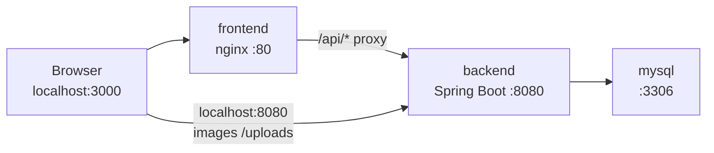

# Dockerization guide

This document describes how the e-commerce monorepo is containerized, which ports and environment variables are involved, and how to run and troubleshoot the stack.

## Project structure

| Path | Role |
|------|------|
| `frontend/` | React 18 SPA built with **Vite 5** (`npm run dev` / `npm run build`). |
| `src/main/java/`, `pom.xml` (repo root) | **Spring Boot 4** backend (Java 17, Maven). REST API under `/api/**`. |
| `backend/Dockerfile` | Multi-stage build for the Spring Boot app. **Build context is the repository root** (not `backend/`), because `pom.xml` and `src/` live at the root. |
| `frontend/Dockerfile` | Multi-stage build: `npm ci` + `vite build`, then **nginx** serves static files and proxies `/api` to the backend service. |
| `docker-compose.yml` | Orchestrates **MySQL 8**, **backend**, and **frontend** on a shared bridge network. |

There is no separate `backend/` source folder; only the Dockerfile lives under `backend/` for clarity.

## Frontend runtime details

- **Framework:** React with Vite.
- **Local development:** `npm run dev` — Vite dev server on **port 3000**, with `vite.config.js` proxying `/api` → `http://localhost:8080`.
- **Docker (this setup):** Production static assets from `vite build` are served by **nginx** on container port **80**, mapped to host **3000** by default. The browser talks to the same origin (`http://localhost:3000`); API calls go to `/api`, and nginx forwards them to the backend container (`http://backend:8080`).
- **Axios base URL:** `frontend/src/lib/api.js` uses `import.meta.env.VITE_API_URL || '/api'`. In Docker we rely on the default **`/api`**, which matches nginx and avoids CORS issues for API traffic.
- **Optional:** `VITE_GROQ_API_KEY` for the chat feature — set at **build** time if you need it inside the image (`docker compose build --build-arg` requires a small Dockerfile change, or bake via `.env` used by CI). Locally you can use a `.env` file with Vite as usual.

## Backend runtime details

- **Framework:** Spring Boot 4.0.x (Maven, Java 17).
- **Default port:** **8080** (`server.port` not overridden).
- **Database:** MySQL (JPA, `ddl-auto=update`). In Docker, JDBC URL is overridden via environment variables (see below).
- **Static uploads:** `/uploads/**` is served from the filesystem (`file:uploads/`). The compose file mounts a named volume at `/app/uploads` so uploads survive container restarts.
- **CORS:** `SecurityConfig` allows origin `http://localhost:3000`, which matches how users open the UI when using the default **3000** host port mapping.
- **Image URLs in the UI:** Several components prefix relative image paths with `http://localhost:8080`. With compose, backend port **8080** is published to the host by default, so those URLs still resolve in the browser.

## Ports

| Service | Container port | Default host mapping | Purpose |
|---------|----------------|----------------------|---------|
| frontend (nginx) | 80 | 3000 | Web UI |
| backend (Spring Boot) | 8080 | 8080 | REST API & `/uploads` |
| MySQL | 3306 | **3307** (default) | Database exposed for optional SQL clients; **3307** avoids conflict with MySQL on the host using 3306. |

Override host ports with environment variables:

- `FRONTEND_HOST_PORT` (default `3000`)
- `BACKEND_HOST_PORT` (default `8080`)
- `MYSQL_HOST_PORT` (default `3307`)

## Environment variables

### Docker Compose (recommended)

| Variable | Default | Used by |
|----------|---------|---------|
| `MYSQL_ROOT_PASSWORD` | `ecommerce_root` | MySQL root password; must match `SPRING_DATASOURCE_PASSWORD` for the backend. |

Spring Boot picks up standard datasource overrides:

- `SPRING_DATASOURCE_URL` — set in `docker-compose.yml` to `jdbc:mysql://mysql:3306/ecommerce_db?useSSL=false&allowPublicKeyRetrieval=true`
- `SPRING_DATASOURCE_USERNAME` — `root`
- `SPRING_DATASOURCE_PASSWORD` — same as `MYSQL_ROOT_PASSWORD`

Other settings (mail, Stripe, Cloudinary) continue to come from `src/main/resources/application.properties` packaged in the JAR, unchanged.

### Local development (no Docker)

- **Backend:** `application.properties` uses `jdbc:mysql://localhost:3306/ecommerce_db` and your local MySQL credentials.
- **Frontend:** Optional `.env` with `VITE_API_URL` and `VITE_GROQ_API_KEY` as needed.

## Docker architecture



- **Network:** All services attach to bridge network `ecom-net`. DNS names match service names: `mysql`, `backend`, `frontend`.
- **Dependency order:** Backend starts after MySQL is healthy. Frontend starts after the backend container is created (nginx will return 502 if the backend is still starting; refresh after a few seconds).
- **Volumes:**
  - `mysql_data` — persistent MySQL data.
  - `backend_uploads` — persistent files under `/app/uploads` in the backend container.

## How to run with Docker

Prerequisites: [Docker Engine](https://docs.docker.com/engine/install/) and Docker Compose v2.

From the **repository root** (where `docker-compose.yml` is):

```bash
docker compose up --build
```

Then open:

- **App:** http://localhost:3000  
- **API example:** http://localhost:8080/api/products  

Stop:

```bash
docker compose down
```

Remove volumes (wipes DB and uploaded files):

```bash
docker compose down -v
```

## Troubleshooting

### Backend exits or cannot connect to MySQL

- Ensure MySQL healthcheck passes (wait for `mysql` to be healthy in `docker compose ps`).
- Confirm `SPRING_DATASOURCE_URL` uses hostname **`mysql`**, not `localhost`, inside Docker.
- If you changed `MYSQL_ROOT_PASSWORD`, ensure the backend service uses the same value for `SPRING_DATASOURCE_PASSWORD`.

### Frontend loads but API calls fail

- Confirm nginx proxy: open DevTools → Network; requests to `/api/...` should return 200, not 404 from nginx.
- If you see 502, the backend may still be starting — wait and retry.
- Do not set `VITE_API_URL` to an absolute URL unless you also align CORS on the backend; the default `/api` path is intended for this compose setup.

### Port already in use

- Set `FRONTEND_HOST_PORT`, `BACKEND_HOST_PORT`, or `MYSQL_HOST_PORT` to free ports on your machine.

### CORS errors

- The UI should be opened at **`http://localhost:3000`** (matching `allowedOrigins` in `SecurityConfig`). Using `127.0.0.1` or another port can trigger CORS for some flows.

### Maven or npm failures during `docker compose build`

- Ensure the build runs online (dependencies are downloaded inside the build containers).
- On slow networks, increase Docker’s resources or retry the build.

### OneDrive / file sync issues

- Docker bind mounts and builds can be flaky on synced folders. If builds fail mysteriously, clone or copy the project to a non-synced path and retry.

## Summary of generated artifacts

| File | Purpose |
|------|---------|
| `docker-compose.yml` | Services, ports, env, volumes, network. |
| `backend/Dockerfile` | Maven build + JRE runtime for Spring Boot (context: repo root). |
| `frontend/Dockerfile` | Node build + nginx runtime. |
| `frontend/nginx.conf` | SPA routing + `/api` reverse proxy to `backend:8080`. |
| `.dockerignore` | Smaller/faster backend build context. |
| `frontend/.dockerignore` | Avoids copying local `node_modules` into the frontend build. |

No application business logic, routes, or UI code were changed for Docker; only Docker-related files and ignore lists were added.
